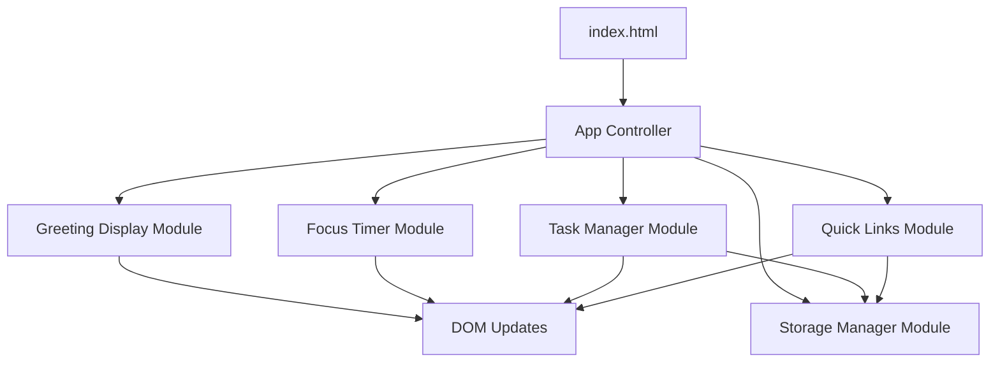

# Technical Design Document

## Overview

The To-Do List Life Dashboard is a single-page web application built with vanilla HTML, CSS, and JavaScript. The application provides a unified productivity interface combining time awareness, task management, a focus timer, and quick website access. All data persistence is handled through the browser's Local Storage API, making the application entirely client-side with no server dependencies.

### Design Goals

1. **Simplicity**: No build process, no frameworks - just open the HTML file in a browser
2. **Maintainability**: Clear separation of concerns with organized code structure
3. **Performance**: Fast load times and responsive interactions
4. **Reliability**: Robust Local Storage handling with data consistency guarantees

### Technology Stack

- **HTML5**: Semantic markup for structure
- **CSS3**: Modern styling with flexbox/grid layouts
- **Vanilla JavaScript (ES6+)**: No frameworks or libraries
- **Local Storage API**: Browser-native persistence

## Architecture

### File Structure

```
todo-list-life-dashboard/
├── index.html          # Main entry point
├── css/
│   └── styles.css      # All application styles
└── js/
    └── app.js          # All application logic
```

### Component Architecture

The application follows a modular component pattern where each feature is encapsulated in its own module with clear responsibilities:



### Module Responsibilities

1. **App Controller**: Initializes all modules and coordinates startup
2. **Greeting Display Module**: Manages time/date display and greeting logic
3. **Focus Timer Module**: Handles countdown timer state and controls
4. **Task Manager Module**: Manages task CRUD operations and UI
5. **Quick Links Module**: Manages quick link CRUD operations and UI
6. **Storage Manager Module**: Abstracts Local Storage operations with error handling

## Components and Interfaces

### 1. Storage Manager Module

**Purpose**: Centralized Local Storage access with error handling and data validation.

**Interface**:
```javascript
const StorageManager = {
  // Retrieve data from Local Storage
  get(key) -> Object | null
  
  // Save data to Local Storage
  set(key, value) -> boolean
  
  // Remove data from Local Storage
  remove(key) -> boolean
  
  // Check if key exists
  has(key) -> boolean
}
```

**Storage Keys**:
- `tasks`: Array of task objects
- `quickLinks`: Array of quick link objects

**Error Handling**:
- Catches and logs quota exceeded errors
- Returns null/false on failure rather than throwing
- Validates JSON parsing with try-catch

### 2. Greeting Display Module

**Purpose**: Display current time, date, and contextual greeting.

**Interface**:
```javascript
const GreetingDisplay = {
  // Initialize the greeting display
  init(containerElement) -> void
  
  // Update time and greeting (called every minute)
  update() -> void
  
  // Get greeting based on current hour
  getGreeting(hour) -> string
  
  // Format time in 12-hour format
  formatTime(date) -> string
  
  // Format date in human-readable format
  formatDate(date) -> string
}
```

**Update Strategy**:
- Uses `setInterval` with 1000ms interval for time updates
- Calculates greeting based on hour ranges:
  - 5:00-11:59 AM: "Good Morning"
  - 12:00-4:59 PM: "Good Afternoon"
  - 5:00-8:59 PM: "Good Evening"
  - 9:00 PM-4:59 AM: "Good Night"

### 3. Focus Timer Module

**Purpose**: 25-minute countdown timer with start/stop/reset controls.

**Interface**:
```javascript
const FocusTimer = {
  // Initialize timer with DOM elements
  init(displayElement, startBtn, stopBtn, resetBtn) -> void
  
  // Start countdown
  start() -> void
  
  // Stop/pause countdown
  stop() -> void
  
  // Reset to 25 minutes
  reset() -> void
  
  // Update display with current time
  updateDisplay() -> void
  
  // Format seconds as MM:SS
  formatTime(seconds) -> string
}
```

**State Management**:
```javascript
{
  timeRemaining: 1500,  // seconds (25 minutes)
  isRunning: false,
  intervalId: null
}
```

**Timer Logic**:
- Decrements `timeRemaining` every second when running
- Stops automatically at zero
- Updates display using `formatTime` helper
- Clears interval on stop/reset to prevent memory leaks

### 4. Task Manager Module

**Purpose**: Manage task list with CRUD operations and Local Storage persistence.

**Interface**:
```javascript
const TaskManager = {
  // Initialize with DOM container
  init(containerElement, inputElement, addButton) -> void
  
  // Load tasks from Local Storage
  loadTasks() -> void
  
  // Add new task
  addTask(text) -> boolean
  
  // Edit existing task
  editTask(id, newText) -> boolean
  
  // Toggle task completion
  toggleComplete(id) -> boolean
  
  // Delete task
  deleteTask(id) -> boolean
  
  // Render all tasks to DOM
  render() -> void
  
  // Save tasks to Local Storage
  saveTasks() -> boolean
}
```

**Task Data Model**:
```javascript
{
  id: string,           // Unique identifier (timestamp-based)
  text: string,         // Task description
  completed: boolean,   // Completion status
  createdAt: number     // Timestamp
}
```

**Rendering Strategy**:
- Full re-render on any change (simple and reliable)
- Creates task elements with event listeners
- Applies completion styling via CSS class
- Inline edit mode replaces task text with input field

### 5. Quick Links Module

**Purpose**: Manage quick access links to favorite websites.

**Interface**:
```javascript
const QuickLinks = {
  // Initialize with DOM container
  init(containerElement, nameInput, urlInput, addButton) -> void
  
  // Load links from Local Storage
  loadLinks() -> void
  
  // Add new quick link
  addLink(name, url) -> boolean
  
  // Delete quick link
  deleteLink(id) -> boolean
  
  // Open link in new tab
  openLink(url) -> void
  
  // Render all links to DOM
  render() -> void
  
  // Save links to Local Storage
  saveLinks() -> boolean
}
```

**Quick Link Data Model**:
```javascript
{
  id: string,      // Unique identifier
  name: string,    // Display name
  url: string      // Target URL
}
```

**URL Validation**:
- Ensures URL starts with http:// or https://
- Prepends https:// if protocol missing
- Validates non-empty name and URL

### 6. App Controller

**Purpose**: Initialize and coordinate all modules.

**Interface**:
```javascript
const App = {
  // Initialize entire application
  init() -> void
}
```

**Initialization Sequence**:
1. Wait for DOM content loaded
2. Initialize Storage Manager
3. Initialize Greeting Display with interval
4. Initialize Focus Timer with controls
5. Initialize Task Manager with data load
6. Initialize Quick Links with data load

## Data Models

### Task Object
```javascript
{
  id: "1234567890123",      // Timestamp-based unique ID
  text: "Complete project", // Task description (non-empty string)
  completed: false,         // Boolean completion status
  createdAt: 1234567890123  // Creation timestamp
}
```

### Quick Link Object
```javascript
{
  id: "1234567890124",           // Timestamp-based unique ID
  name: "GitHub",                // Display name (non-empty string)
  url: "https://github.com"      // Full URL with protocol
}
```

### Local Storage Schema
```javascript
{
  "tasks": [
    { id, text, completed, createdAt },
    ...
  ],
  "quickLinks": [
    { id, name, url },
    ...
  ]
}
```

## Error Handling

### Local Storage Error Scenarios

1. **Quota Exceeded**
   - Catch `QuotaExceededError`
   - Log error to console
   - Show user-friendly message
   - Prevent data loss by maintaining in-memory state

2. **JSON Parse Errors**
   - Wrap `JSON.parse` in try-catch
   - Return empty array on parse failure
   - Log corruption warning

3. **Browser Compatibility**
   - Check for `localStorage` availability
   - Graceful degradation: app works but doesn't persist

### User Input Validation

1. **Task Text**
   - Trim whitespace
   - Reject empty strings
   - Maximum length: 500 characters (enforced in HTML)

2. **Quick Link URL**
   - Validate non-empty
   - Auto-prepend https:// if missing protocol
   - Basic URL format validation

3. **Edit Operations**
   - Prevent saving empty task text
   - Revert to original on empty input

## Testing Strategy

This application uses vanilla JavaScript with DOM manipulation and Local Storage, making it suitable for example-based unit testing rather than property-based testing. The testing strategy focuses on:

### Unit Testing Approach

**Test Categories**:

1. **Module Logic Tests** - Test pure functions in isolation
   - Greeting calculation based on hour
   - Time formatting (seconds to MM:SS)
   - Date formatting
   - URL validation and normalization

2. **DOM Manipulation Tests** - Test rendering and event handling
   - Task list rendering with various states
   - Timer display updates
   - Quick link button creation
   - Edit mode toggling

3. **Local Storage Integration Tests** - Test persistence layer
   - Save and retrieve tasks
   - Save and retrieve quick links
   - Handle corrupted data
   - Handle quota exceeded errors

4. **State Management Tests** - Test module state consistency
   - Timer state transitions (stopped → running → stopped)
   - Task completion toggling
   - Edit mode state management

**Testing Tools**:
- Manual testing by opening index.html in browsers
- Browser DevTools console for debugging
- Local Storage inspection via DevTools Application tab

**Test Scenarios**:

1. **Greeting Display**
   - Verify correct greeting for each time range
   - Verify time format (12-hour with AM/PM)
   - Verify date format includes day, month, date

2. **Focus Timer**
   - Start timer and verify countdown
   - Stop timer and verify pause
   - Reset timer and verify return to 25:00
   - Verify timer stops at 00:00

3. **Task Management**
   - Add task with valid text
   - Reject empty task
   - Edit task and save
   - Reject empty edit
   - Toggle completion status
   - Delete task
   - Verify persistence after page reload

4. **Quick Links**
   - Add link with name and URL
   - Verify URL opens in new tab
   - Delete link
   - Verify persistence after page reload

5. **Browser Compatibility**
   - Test in Chrome, Firefox, Edge, Safari
   - Verify all features work consistently

6. **Performance**
   - Measure initial load time (< 1 second)
   - Verify interaction responsiveness (< 100ms feedback)
   - Test with 100 tasks (< 200ms render time)

**No Property-Based Testing**: This application is not suitable for property-based testing because:
- It's primarily UI-focused with DOM manipulation
- Most operations are CRUD with Local Storage (side effects)
- No complex algorithms or data transformations
- Testing approach should focus on user interactions and integration points

## HTML Structure

### Document Structure
```html
<!DOCTYPE html>
<html lang="en">
<head>
  <meta charset="UTF-8">
  <meta name="viewport" content="width=device-width, initial-scale=1.0">
  <title>Life Dashboard</title>
  <link rel="stylesheet" href="css/styles.css">
</head>
<body>
  <div class="dashboard">
    <!-- Greeting Section -->
    <section class="greeting-section">
      <div id="greeting"></div>
      <div id="datetime"></div>
    </section>
    
    <!-- Focus Timer Section -->
    <section class="timer-section">
      <div id="timer-display">25:00</div>
      <div class="timer-controls">
        <button id="timer-start">Start</button>
        <button id="timer-stop">Stop</button>
        <button id="timer-reset">Reset</button>
      </div>
    </section>
    
    <!-- Task List Section -->
    <section class="tasks-section">
      <h2>Tasks</h2>
      <div class="task-input">
        <input type="text" id="task-input" placeholder="Add a new task..." maxlength="500">
        <button id="task-add">Add</button>
      </div>
      <div id="task-list"></div>
    </section>
    
    <!-- Quick Links Section -->
    <section class="links-section">
      <h2>Quick Links</h2>
      <div class="link-input">
        <input type="text" id="link-name" placeholder="Name">
        <input type="text" id="link-url" placeholder="URL">
        <button id="link-add">Add</button>
      </div>
      <div id="link-list"></div>
    </section>
  </div>
  
  <script src="js/app.js"></script>
</body>
</html>
```

### Semantic Elements
- `<section>` for major feature areas
- `<button>` for all interactive controls
- `<input>` with appropriate types and attributes
- Proper heading hierarchy (h2 for section titles)

## CSS Architecture

### Design System

**Color Palette**:
```css
:root {
  --primary-bg: #f5f5f5;
  --secondary-bg: #ffffff;
  --text-primary: #333333;
  --text-secondary: #666666;
  --accent: #4a90e2;
  --accent-hover: #357abd;
  --success: #5cb85c;
  --danger: #d9534f;
  --border: #dddddd;
}
```

**Typography**:
```css
:root {
  --font-family: -apple-system, BlinkMacSystemFont, 'Segoe UI', Roboto, Oxygen, Ubuntu, Cantarell, sans-serif;
  --font-size-base: 16px;
  --font-size-small: 14px;
  --font-size-large: 20px;
  --font-size-xlarge: 32px;
}
```

**Spacing Scale**:
```css
:root {
  --spacing-xs: 4px;
  --spacing-sm: 8px;
  --spacing-md: 16px;
  --spacing-lg: 24px;
  --spacing-xl: 32px;
}
```

### Layout Strategy

**Dashboard Grid**:
- CSS Grid for main dashboard layout
- Responsive breakpoints for mobile/tablet/desktop
- Flexbox for component internal layouts

**Component Spacing**:
- Consistent padding/margin using spacing scale
- Minimum 44px touch targets for mobile
- Clear visual separation between sections

### Interactive States

**Button States**:
```css
button {
  /* Default state */
  background: var(--accent);
  color: white;
  transition: background 0.2s ease;
}

button:hover {
  /* Hover feedback */
  background: var(--accent-hover);
}

button:active {
  /* Click feedback */
  transform: scale(0.98);
}

button:disabled {
  /* Disabled state */
  opacity: 0.5;
  cursor: not-allowed;
}
```

**Task States**:
```css
.task {
  /* Default task */
  background: var(--secondary-bg);
  border: 1px solid var(--border);
}

.task.completed {
  /* Completed task */
  opacity: 0.6;
  text-decoration: line-through;
}

.task:hover {
  /* Hover state */
  box-shadow: 0 2px 4px rgba(0,0,0,0.1);
}
```

## JavaScript Implementation Details

### Module Pattern

Each module uses the Revealing Module Pattern for encapsulation:

```javascript
const ModuleName = (function() {
  // Private variables
  let privateState = {};
  
  // Private functions
  function privateHelper() {
    // ...
  }
  
  // Public interface
  return {
    init: function() {
      // ...
    },
    publicMethod: function() {
      // ...
    }
  };
})();
```

### Event Handling

**Event Delegation**:
- Use event delegation for dynamically created elements
- Attach listeners to parent containers
- Check event.target for specific element types

**Example**:
```javascript
taskListContainer.addEventListener('click', function(e) {
  if (e.target.classList.contains('task-delete')) {
    const taskId = e.target.dataset.taskId;
    TaskManager.deleteTask(taskId);
  }
});
```

### Data Flow

**Unidirectional Data Flow**:
1. User interaction triggers event
2. Event handler updates module state
3. State change triggers save to Local Storage
4. State change triggers re-render
5. DOM updates reflect new state

**Example Flow (Add Task)**:
```
User clicks "Add" 
  → addTask() validates input
  → Task added to tasks array
  → saveTasks() writes to Local Storage
  → render() updates DOM
  → Input field cleared
```

### Performance Optimizations

1. **Debouncing**: Not needed for this simple app
2. **Throttling**: Timer updates already limited to 1 second
3. **Efficient Rendering**: Full re-render is acceptable for small lists
4. **Event Listener Management**: Remove listeners when elements destroyed

### Browser Compatibility Considerations

**ES6 Features Used**:
- Arrow functions
- Template literals
- const/let
- Array methods (map, filter, find)

**Polyfills**: Not needed - all features supported in target browsers (Chrome 90+, Firefox 88+, Edge 90+, Safari 14+)

**Feature Detection**:
```javascript
if (typeof(Storage) !== "undefined") {
  // Local Storage available
} else {
  // Fallback: in-memory only
  console.warn("Local Storage not available");
}
```

## Implementation Guidelines

### Code Style

1. **Naming Conventions**:
   - camelCase for variables and functions
   - PascalCase for module names
   - UPPER_SNAKE_CASE for constants
   - Descriptive names (no abbreviations)

2. **Code Organization**:
   - Group related functions together
   - Public methods at top of module
   - Private helpers below
   - Constants at module top

3. **Comments**:
   - JSDoc-style comments for public methods
   - Inline comments for complex logic
   - No obvious comments

### Development Workflow

1. **Setup**: Create file structure
2. **HTML First**: Build semantic structure
3. **CSS Second**: Style all components
4. **JavaScript Last**: Implement functionality module by module
5. **Testing**: Manual testing in all target browsers

### Debugging Strategy

1. **Console Logging**: Strategic console.log for state changes
2. **DevTools**: Use breakpoints for complex logic
3. **Local Storage Inspection**: Verify data persistence
4. **Network Tab**: Verify no unexpected requests

## Security Considerations

### XSS Prevention

**User Input Sanitization**:
- Use `textContent` instead of `innerHTML` for user-generated content
- Never use `eval()` or `Function()` constructor
- Validate and sanitize URLs before opening

**Example**:
```javascript
// Safe: Uses textContent
taskElement.textContent = taskText;

// Unsafe: Would allow script injection
// taskElement.innerHTML = taskText; // DON'T DO THIS
```

### Local Storage Security

**Data Sensitivity**:
- No sensitive data stored (passwords, tokens, etc.)
- All data is user-generated and non-sensitive
- Local Storage is domain-scoped (safe from other sites)

**Data Validation**:
- Validate data structure on load
- Handle corrupted data gracefully
- Never execute code from Local Storage

## Accessibility Considerations

### Keyboard Navigation

- All interactive elements accessible via Tab key
- Logical tab order following visual layout
- Enter key activates buttons
- Escape key cancels edit mode

### ARIA Attributes

```html
<button aria-label="Delete task">×</button>
<input aria-label="Task description" placeholder="Add a new task...">
<div role="timer" aria-live="polite" id="timer-display">25:00</div>
```

### Visual Accessibility

- Minimum 4.5:1 contrast ratio for text
- Focus indicators on all interactive elements
- Sufficient touch target sizes (44px minimum)
- No color-only information conveyance

## Future Enhancements (Out of Scope)

These features are explicitly excluded from the current implementation:

1. **Backend Sync**: Cloud storage or multi-device sync
2. **User Authentication**: Login/signup functionality
3. **Advanced Timer**: Custom durations, multiple timers
4. **Task Categories**: Tags, projects, priorities
5. **Data Export**: CSV/JSON export functionality
6. **Themes**: Dark mode or custom color schemes
7. **Notifications**: Browser notifications when timer completes
8. **Analytics**: Usage tracking or statistics

## Deployment

### Hosting Options

1. **Local File System**: Open index.html directly
2. **GitHub Pages**: Push to gh-pages branch
3. **Netlify/Vercel**: Drag-and-drop deployment
4. **Any Static Host**: No server-side requirements

### Build Process

**None required** - the application runs directly from source files with no compilation, bundling, or transpilation needed.

## Conclusion

This design provides a complete technical specification for implementing the To-Do List Life Dashboard. The architecture emphasizes simplicity, maintainability, and reliability while meeting all functional requirements. The modular structure allows for easy testing and future enhancements while keeping the codebase accessible to developers of all skill levels.
